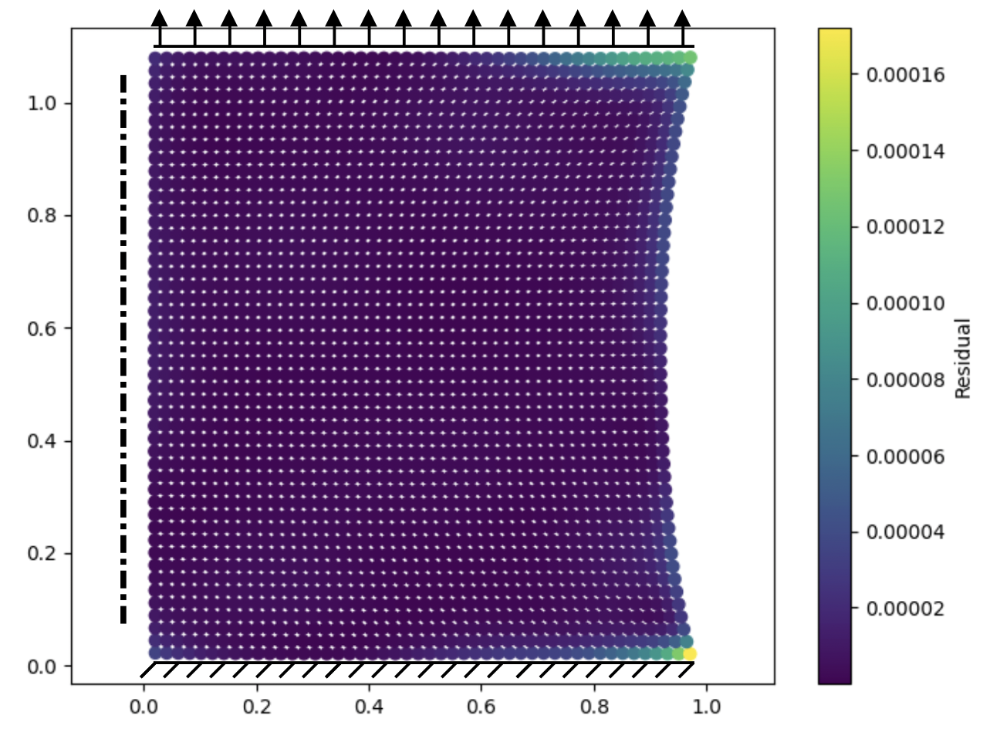

# Elsatic precision PINN

Precision PINN is a Pytorch-based Physics-Informed Neural Network (PINN) implementation designed for solving differential equations with high accuracy. Application to singularity in corners during clamped stretch test:
 



## Installation

First, install pytorch, numpy, matplotlib and pyDOE. Then run:

```bash
git clone https://github.com/yourusername/precision-pinn.git
cd precision-pinn
python elastic_precision_pinn.py
```
## License

This project is licensed under the BSD License.
